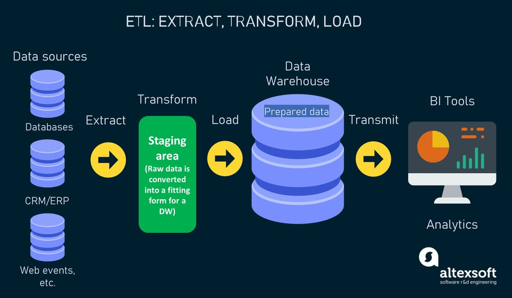
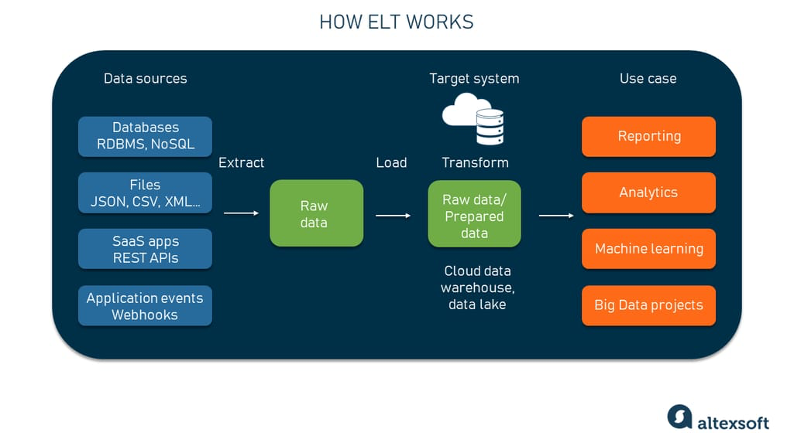

## Table of Contents

- [Table of Contents](#table-of-contents)
- [Hiểu về ETL và ELT: Chiến lược tối ưu sử dụng dữ liệu của doanh nghiệp với Big Data](#hiểu-về-etl-và-elt-chiến-lược-tối-ưu-sử-dụng-dữ-liệu-của-doanh-nghiệp-với-big-data)
  - [1. So sánh ETL và ELT](#1-so-sánh-etl-và-elt)
  - [2. ETL với ví dụ về dữ liệu nhân viên](#2-etl-với-ví-dụ-về-dữ-liệu-nhân-viên)
    - [Bước 1: Trích xuất Dữ liệu từ MySQL](#bước-1-trích-xuất-dữ-liệu-từ-mysql)
    - [Bước 2: Biến đổi Dữ liệu với Spark](#bước-2-biến-đổi-dữ-liệu-với-spark)
    - [Bước 3: Tải Dữ liệu đã Biến đổi vào HDFS](#bước-3-tải-dữ-liệu-đã-biến-đổi-vào-hdfs)
  - [3. ELT với ví dụ về dữ liệu nhân viên](#3-elt-với-ví-dụ-về-dữ-liệu-nhân-viên)
    - [Bước 1: Trích xuất Dữ liệu từ MySQL](#bước-1-trích-xuất-dữ-liệu-từ-mysql-1)
    - [Bước 2: Tải Dữ liệu Thô vào HDFS](#bước-2-tải-dữ-liệu-thô-vào-hdfs)
    - [Bước 3: Biến đổi Dữ liệu trong Hive](#bước-3-biến-đổi-dữ-liệu-trong-hive)
  - [4. ELT với ví dụ về dữ liệu Comment trên PR và đánh giá chất lượng code của SonarQube từ GitHub](#4-elt-với-ví-dụ-về-dữ-liệu-comment-trên-pr-và-đánh-giá-chất-lượng-code-của-sonarqube-từ-github)
    - [Bước 1: Trích xuất Dữ liệu từ GitHub và SonarQube](#bước-1-trích-xuất-dữ-liệu-từ-github-và-sonarqube)
    - [Bước 2: Tải Dữ liệu Thô vào HDFS](#bước-2-tải-dữ-liệu-thô-vào-hdfs-1)
    - [Bước 3: Biến đổi Dữ liệu trong Spark](#bước-3-biến-đổi-dữ-liệu-trong-spark)
    - [Bước 4: Kết nối với Công cụ BI và Tạo Dashboard](#bước-4-kết-nối-với-công-cụ-bi-và-tạo-dashboard)
  - [5. ELT với ví dụ về thông tin dự án trên JIRA](#5-elt-với-ví-dụ-về-thông-tin-dự-án-trên-jira)
    - [Bước 1: Trích xuất Dữ liệu từ JIRA](#bước-1-trích-xuất-dữ-liệu-từ-jira)
    - [Bước 2: Tải Dữ liệu Thô vào HDFS](#bước-2-tải-dữ-liệu-thô-vào-hdfs-2)
    - [Bước 3: Biến đổi Dữ liệu trong Spark](#bước-3-biến-đổi-dữ-liệu-trong-spark-1)
    - [Bước 4: Kết nối với Công cụ BI và Tạo Dashboard](#bước-4-kết-nối-với-công-cụ-bi-và-tạo-dashboard-1)
  - [Kết luận](#kết-luận)

## Hiểu về ETL và ELT: Chiến lược tối ưu sử dụng dữ liệu của doanh nghiệp với Big Data

Trong thế giới tích hợp dữ liệu, ETL (Extract, Transform, Load) và ELT (Extract, Load, Transform) là hai phương pháp phổ biến được sử dụng để xử lý dữ liệu từ nhiều nguồn khác nhau. Cả hai đều có quy trình và ứng dụng riêng biệt. Bài viết này sẽ đi sâu vào sự khác biệt giữa ETL và ELT, cung cấp ví dụ về mỗi phương pháp sử dụng dữ liệu nhân viên, và trình bày các bước liên quan trong mỗi quy trình.

### 1. So sánh ETL và ELT

**ETL (Extract, Transform, Load)**:



- **Extract**: Dữ liệu được trích xuất từ nhiều nguồn như cơ sở dữ liệu, hệ thống CRM, sự kiện web, v.v.
- **Transform**: Dữ liệu sau đó được biến đổi thành định dạng phù hợp cho phân tích. Bước này bao gồm làm sạch, lọc và áp dụng các quy tắc kinh doanh.
- **Load**: Cuối cùng, dữ liệu đã được biến đổi được tải vào Kho dữ liệu (Data Warehouse), sẵn sàng cho phân tích.

**ELT (Extract, Load, Transform)**:



- **Extract**: Dữ liệu được trích xuất từ nhiều nguồn như ETL.
- **Load**: Dữ liệu thô sau đó được tải trực tiếp vào Data Lake hoặc Data Warehouse.
- **Transform**: Quá trình biến đổi diễn ra trong Data Lake hoặc Data Warehouse, nơi dữ liệu được làm sạch, lọc và chuẩn bị cho phân tích.

### 2. ETL với ví dụ về dữ liệu nhân viên

Trong ví dụ này, chúng ta sẽ sử dụng Hadoop và Spark để thực hiện quá trình ETL với dữ liệu nhân viên từ MySQL.

#### Bước 1: Trích xuất Dữ liệu từ MySQL

Dữ liệu nhân viên được trích xuất từ cơ sở dữ liệu MySQL.

#### Bước 2: Biến đổi Dữ liệu với Spark

Dữ liệu được biến đổi để tính toán các thông tin như tuổi và thời gian làm việc (seniority) của nhân viên. Bước này bao gồm việc làm sạch, lọc và chuẩn bị dữ liệu theo định dạng phù hợp cho phân tích.

#### Bước 3: Tải Dữ liệu đã Biến đổi vào HDFS

Dữ liệu sau khi biến đổi được lưu trữ vào HDFS dưới định dạng ORC để dễ dàng xử lý bởi Hive. Cuối cùng, dữ liệu đã được tải vào Kho dữ liệu (Data Warehouse), sẵn sàng cho phân tích.

### 3. ELT với ví dụ về dữ liệu nhân viên

Trong ví dụ này, chúng ta sẽ sử dụng Hadoop, Spark, và Hive để thực hiện quá trình ELT với dữ liệu nhân viên từ MySQL.

#### Bước 1: Trích xuất Dữ liệu từ MySQL

Dữ liệu nhân viên được trích xuất từ cơ sở dữ liệu MySQL và lưu trữ vào HDFS dưới dạng thô.

#### Bước 2: Tải Dữ liệu Thô vào HDFS

Dữ liệu thô được tải trực tiếp vào HDFS, một thành phần của Data Lake.

#### Bước 3: Biến đổi Dữ liệu trong Hive

Dữ liệu được biến đổi trong Hive để tính toán các thông tin như tuổi và thời gian làm việc (seniority) của nhân viên. Sau đó, dữ liệu đã biến đổi được lưu trữ lại trong HDFS, phục vụ cho phân tích và truy vấn nhanh trong Data Lake hoặc Data Warehouse.

### 4. ELT với ví dụ về dữ liệu Comment trên PR và đánh giá chất lượng code của SonarQube từ GitHub

Trong ví dụ này, chúng ta sẽ sử dụng GitHub API, Hadoop, Spark, và SonarQube để thực hiện quá trình ELT với dữ liệu Comment trên Pull Request (PR) và đánh giá chất lượng code từ SonarQube.

#### Bước 1: Trích xuất Dữ liệu từ GitHub và SonarQube

Dữ liệu Comment trên PR và đánh giá chất lượng code (bug, vulnerability) được trích xuất từ GitHub API và SonarQube API. Dữ liệu này bao gồm:

- **GitHub Comments**: ID comment, ID PR, tác giả, thời gian, nội dung.
- **SonarQube Issues**: ID dự án, loại vấn đề (bug, vulnerability), mức độ nghiêm trọng, mô tả, dòng mã lỗi.

**Định dạng output**: JSON

```json
{
  "github_comments": [
    {
      "comment_id": 12345,
      "pr_id": 67890,
      "author": "user1",
      "timestamp": "2024-06-15T12:34:56Z",
      "content": "This is a comment on the PR."
    }
  ],
  "sonarqube_issues": [
    {
      "project_id": "my_project",
      "issue_type": "bug",
      "severity": "major",
      "description": "Null pointer exception",
      "line": 42
    }
  ]
}
```

#### Bước 2: Tải Dữ liệu Thô vào HDFS

Dữ liệu thô từ GitHub và SonarQube được tải trực tiếp vào HDFS, một thành phần của Data Lake.

**Định dạng output**: JSON files được lưu trữ trong HDFS.

```shell
hdfs dfs -put github_comments.json /data/github/
hdfs dfs -put sonarqube_issues.json /data/sonarqube/
```

#### Bước 3: Biến đổi Dữ liệu trong Spark

Dữ liệu được biến đổi trong Spark để phân tích và tổng hợp các thông tin quan trọng như:

- **Tổng số comment trên mỗi PR**
- **Phân loại các comment**: comment mang tính xây dựng, câu hỏi, phê bình, v.v.
- **Tổng số lỗi và lỗ hổng bảo mật được phát hiện bởi SonarQube**
- **Thống kê về chất lượng code theo thời gian**

Các bước biến đổi bao gồm:

1. Đọc dữ liệu từ HDFS.
2. Tính toán tổng số comment trên mỗi PR.
3. Phân loại các comment dựa trên nội dung.
4. Tính toán tổng số lỗi và lỗ hổng bảo mật theo dự án và mức độ nghiêm trọng.
5. Tạo các bảng thống kê về chất lượng code theo thời gian.

**Định dạng output**: ORC files để tối ưu cho Hive.

```shell
hdfs dfs -put comments_per_pr.orc /data/transformed/comments_per_pr/
hdfs dfs -put classified_comments.orc /data/transformed/classified_comments/
hdfs dfs -put issue_summary.orc /data/transformed/issue_summary/
hdfs dfs -put code_quality_over_time.orc /data/transformed/code_quality_over_time/
```

**Định dạng output**: ORC files cho hiệu suất cao.

```shell
hdfs dfs -ls /data/transformed/
```

#### Bước 4: Kết nối với Công cụ BI và Tạo Dashboard

Dữ liệu được biến đổi trong bước trước sẽ được kết nối với một công cụ BI (Business Intelligence) như Tableau hoặc Power BI để trực quan hóa các thông tin lên dashboard. Các bước bao gồm:

1. **Kết nối Công cụ BI với Hive**:
   - Thiết lập kết nối từ Tableau hoặc Power BI đến Hive.
   - Cấu hình các kết nối cần thiết để truy xuất dữ liệu từ các bảng ORC đã lưu trữ trong HDFS.

2. **Tạo Dashboard**:
   - Tạo các bảng và biểu đồ để hiển thị các thông tin như:
     - Tổng số comment trên mỗi PR.
     - Phân loại các comment.
     - Tổng số lỗi và lỗ hổng bảo mật theo dự án.
     - Thống kê về chất lượng code theo thời gian.
   - Sử dụng các công cụ BI để kéo dữ liệu từ Hive và hiển thị lên các bảng điều khiển (dashboards) một cách trực quan.

**Ví dụ về Dashboard**:

- **Bảng Điều Khiển 1**: Tổng số comment trên mỗi PR
  - Biểu đồ cột hoặc biểu đồ thanh hiển thị số lượng comment theo PR.

- **Bảng Điều Khiển 2**: Phân loại các comment
  - Biểu đồ hình tròn hoặc biểu đồ thanh phân loại các loại comment (xây dựng, câu hỏi, phê bình).

- **Bảng Điều Khiển 3**: Tổng số lỗi và lỗ hổng bảo mật
  - Biểu đồ cột hiển thị số lượng lỗi và lỗ hổng bảo mật theo dự án và mức độ nghiêm trọng.

- **Bảng Điều Khiển 4**: Chất lượng code theo thời gian
  - Biểu đồ đường hoặc biểu đồ thanh hiển thị thống kê về chất lượng code theo thời gian, với các mốc thời gian khác nhau.

### 5. ELT với ví dụ về thông tin dự án trên JIRA

Trong ví dụ này, chúng ta sẽ sử dụng JIRA API, Hadoop, Spark, và Hive để thực hiện quá trình ELT với dữ liệu thông tin dự án từ JIRA, bao gồm các thông tin về estimated effort, actual effort qua các giai đoạn (planning, design, code, test) của dự án, nhằm đánh giá chất lượng của việc tiến hành dự án, lượng rework, và xác định giai đoạn nào có sự bất thường, cũng như phân tích năng suất (productivity) của từng cá nhân.

#### Bước 1: Trích xuất Dữ liệu từ JIRA

Dữ liệu về dự án từ JIRA được trích xuất bằng cách sử dụng JIRA API. Dữ liệu này bao gồm:

- **JIRA Project Data**: Project ID, Project Name, Stage, Estimated Effort, Actual Effort, Person In Charge (PIC).

**Định dạng output**: JSON

```json
{
  "jira_project_data": [
    {
      "project_id": "project_123",
      "project_name": "Example Project",
      "stage": "planning",
      "estimated_effort": 40,
      "actual_effort": 45,
      "pic": "Alice"
    },
    {
      "project_id": "project_123",
      "project_name": "Example Project",
      "stage": "design",
      "estimated_effort": 30,
      "actual_effort": 35,
      "pic": "Bob"
    },
    {
      "project_id": "project_123",
      "project_name": "Example Project",
      "stage": "code",
      "estimated_effort": 50,
      "actual_effort": 60,
      "pic": "Charlie"
    },
    {
      "project_id": "project_123",
      "project_name": "Example Project",
      "stage": "test",
      "estimated_effort": 20,
      "actual_effort": 25,
      "pic": "Dave"
    }
  ]
}
```

#### Bước 2: Tải Dữ liệu Thô vào HDFS

Dữ liệu thô từ JIRA được tải trực tiếp vào HDFS, một thành phần của Data Lake.

**Định dạng output**: JSON files được lưu trữ trong HDFS.

```shell
hdfs dfs -put jira_project_data.json /data/jira/
```

#### Bước 3: Biến đổi Dữ liệu trong Spark

Dữ liệu được biến đổi trong Spark để phân tích và tổng hợp các thông tin quan trọng như:

- **Tổng estimated effort và actual effort cho từng dự án**
- **Phân tích so sánh estimated effort và actual effort cho từng giai đoạn**
- **Xác định lượng rework**
- **Xác định các giai đoạn có sự bất thường**
- **Phân tích productivity của từng cá nhân**

Các bước biến đổi bao gồm:

1. Đọc dữ liệu từ HDFS.
2. Tính toán tổng estimated effort và actual effort cho từng dự án.
3. So sánh estimated effort và actual effort cho từng giai đoạn.
4. Tính toán lượng rework bằng cách so sánh estimated effort và actual effort.
5. Xác định các giai đoạn có sự bất thường dựa trên chênh lệch giữa estimated effort và actual effort.
6. Phân tích productivity của từng cá nhân dựa trên nỗ lực thực tế so với estimated effort.

**Định dạng output**: ORC files để tối ưu cho Hive.

```shell
hdfs dfs -put project_effort_summary.orc /data/transformed/project_effort_summary/
hdfs dfs -put stage_effort_comparison.orc /data/transformed/stage_effort_comparison/
hdfs dfs -put rework_analysis.orc /data/transformed/rework_analysis/
hdfs dfs -put abnormal_stages.orc /data/transformed/abnormal_stages/
hdfs dfs -put pic_productivity.orc /data/transformed/pic_productivity/
```

**Định dạng output**: ORC files cho hiệu suất cao.

```shell
hdfs dfs -ls /data/transformed/
```

#### Bước 4: Kết nối với Công cụ BI và Tạo Dashboard

Dữ liệu được biến đổi trong bước trước sẽ được kết nối với một công cụ BI (Business Intelligence) như Tableau hoặc Power BI để trực quan hóa các thông tin lên dashboard. Các bước bao gồm:

1. **Kết nối Công cụ BI với Hive**:
   - Thiết lập kết nối từ Tableau hoặc Power BI đến Hive.
   - Cấu hình các kết nối cần thiết để truy xuất dữ liệu từ các bảng ORC đã lưu trữ trong HDFS.

2. **Tạo Dashboard**:
   - Tạo các bảng và biểu đồ để hiển thị các thông tin như:
     - Tổng estimated effort và actual effort cho từng dự án.
     - So sánh estimated effort và actual effort cho từng giai đoạn.
     - Lượng rework theo dự án.
     - Các giai đoạn có sự bất thường.
     - Productivity của từng cá nhân (PIC).

**Ví dụ về Dashboard**:

- **Bảng Điều Khiển 1**: Tổng estimated effort và actual effort cho từng dự án
  - Biểu đồ cột hoặc biểu đồ thanh hiển thị tổng estimated effort và actual effort theo dự án.

- **Bảng Điều Khiển 2**: So sánh estimated effort và actual effort cho từng giai đoạn
  - Biểu đồ đường hoặc biểu đồ thanh so sánh estimated effort và actual effort cho từng giai đoạn của dự án.

- **Bảng Điều Khiển 3**: Lượng rework theo dự án
  - Biểu đồ cột hoặc biểu đồ thanh hiển thị lượng rework (sự chênh lệch giữa estimated effort và actual effort) theo dự án.

- **Bảng Điều Khiển 4**: Các giai đoạn có sự bất thường
  - Biểu đồ đường hoặc biểu đồ thanh hiển thị các giai đoạn có sự chênh lệch lớn giữa estimated effort và actual effort.

- **Bảng Điều Khiển 5**: Productivity của từng cá nhân (PIC)
  - Biểu đồ cột hoặc biểu đồ thanh hiển thị năng suất của từng cá nhân, so sánh giữa estimated effort và actual effort.

### Kết luận

- **Tập trung dữ liệu từ nhiều nguồn**: ELT cho phép tập trung dữ liệu từ nhiều nguồn và nhiều định dạng về một nơi, như Data Lake hoặc Data Warehouse.
- **Thuận tiện trong lưu trữ và phân tích**: Dữ liệu thô được lưu trữ và có thể được biến đổi theo nhu cầu, giúp việc lưu trữ và phân tích dễ dàng hơn.
- **Kết hợp phân tích từ nhiều nguồn**: Việc tích hợp dữ liệu từ nhiều nguồn khác nhau giúp tìm ra các insight mới, nâng cao chất lượng phân tích và hỗ trợ ra quyết định chính xác hơn.
- **Hiệu quả quản lý dữ liệu**: ELT giúp doanh nghiệp có cái nhìn toàn diện và dễ dàng thực hiện các phân tích phức tạp, cải thiện hiệu quả quản lý và ra quyết định dựa trên dữ liệu.